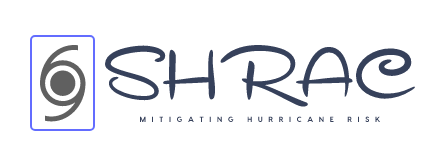

   
*SHRAC* is a Scenario Hurricane Risk Analysis tool for community.

.. toctree::
   :maxdepth: 2

   authors
   installation
   contributing
   Usage
   history
   readme
   API documentation <apidocs/sd>
   Acknowledgement
   reference

  

-------------------------------------
This tool is developed by:
**Sutley Research Group**
Civil, Environmental and Architectural Engineering
University of Kansas

*Advancing Disaster Resilience Science On Communities And Housing*

Indices and tables
==================

* :ref:`genindex`
* :ref:`modindex`
* :ref:`search`
